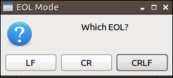
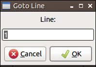
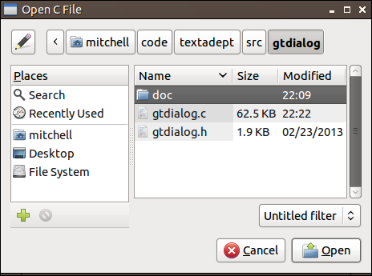
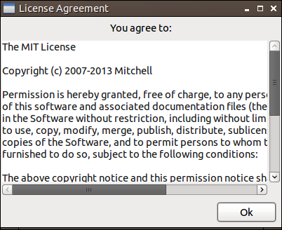
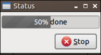
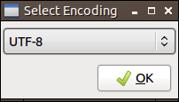
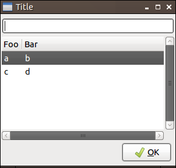

# Usage

## Overview

gtDialog can be used as either a command-line program for shell scripts or as a
C library for applications.

### Using the Command-Line

gtDialog is executed like this:

    gtdialog type arguments

Where `type` is specifies which dialog to use and `arguments` is a set of
arguments for that dialog type. You can get help on types and arguments using:

    gtdialog help [type]

### Using the C Library

In order to use gtDialog as a C library, first include *gtdialog.h* and
*gtdialog.c* in your application. Then call `gtdialog()` with a `GTDialogType`
followed by an `int argc` and a `char *argv[]` like you would have for a
command-line application.  You can use a helper function `gtdialog_type()` for
getting a `GTDialogType` from a string. An example is in the `main()` function
of *gtdialog.c*. You are responsible for calling `free()` on the string returned
by `gtdialog()`.

- - -

## Messageboxes

=`gtdialog msgbox` *args*=
    A generic message box with custom button labels.
=`gtdialog ok-msgbox` *args*=
    Identical to `msgbox`, but with [localized](#Localization) “Ok” and “Cancel”
    buttons.
=`gtdialog yesno-msgbox` *args*=
    Identical to `msgbox`, but with [localized](#Localization) “Yes”, “No”, and
    “Cancel” buttons.

**Arguments**

=`--title str`=
    The dialog's title text.
=`--string-output`=
    Output the names of selected buttons/items or exit codes instead of
    button/item indexes or exit code numbers.
=`--no-newline`=
    Do not output the default trailing newline.
=`--width int`=
    Manually set the width of the dialog in pixels if possible.
=`--height int`=
    Manually set the height of the dialog in pixels if possible.
=`--text str`=
    The main message text.
=`--informative-text str`=
    Extra informative text.
=`--icon str`=
    The name of the [GTK stock icon][] to display. No icon is displayed by
    default. Examples are “gtk-dialog-error”, “gtk-dialog-info”,
    “gtk-dialog-question”, and “gtk-dialog-warning”.
=`--icon-file str`=
    The path to the icon to display. Has no effect when `--icon` is present.
=`--button1 str`=
    The right-most button's label. The default is “Ok” for `ok-msgbox` and “Yes”
    for `yesno-msgbox`.
=`--button2 str`=
    The middle button's label. The default is “Cancel” for `ok-msgbox` and “No”
    for `yesno-msgbox`.
=`--button3 str`=
    The left-most button's label. The default is “Cancel” for `yesno-msgbox`.
    Requires `--button2`.
=`--no-cancel`=
    Only show “Ok” button for `ok-msgbox` and `yesno-msgbox`.
=`--float`=
    Show the dialog on top of all windows.
=`--timeout int`=
    The number of seconds the dialog waits for a button click before timing out.
    Dialogs do not time out by default.

[GTK stock icon]: https://developer.gnome.org/gtk3/stable/gtk3-Stock-Items.html

**Returns**

The message box dialogs return a string containing the number of the button
pressed, ‘0’ if the dialog timed out, or “-1” if the user canceled the dialog.
If `--string-output` was given, the return string contains the label of the
button pressed, “timeout” if the dialog timed out, or “delete” if the user
canceled the dialog.

**Example**

    gtdialog msgbox --title 'EOL Mode' --text 'Which EOL?' \
      --icon gtk-dialog-question \
      --button1 CRLF --button2 CR --button3 LF

- - -

## Inputboxes

=`gtdialog inputbox` *args*=
    A one line input box with custom button labels.
=`gtdialog standard-inputbox` *args*=
    Identical to inputbox, but with [localized](#Localization) “Ok” and “Cancel”
    buttons.
=`gtdialog secure-inputbox` *args*=
    Identical to inputbox, but input is masked.
=`gtdialog secure-standard-inputbox` *args*=
    Identical to standard-inputbox, but input is masked.

**Arguments**

=`--title str`=
    The dialog's title text.
=`--string-output`=
    Output the names of selected buttons/items or exit codes instead of
    button/item indexes or exit code numbers.
=`--no-newline`=
    Do not output the default trailing newline.
=`--width int`=
    Manually set the width of the dialog in pixels if possible.
=`--height int`=
    Manually set the height of the dialog in pixels if possible.
=`--informative-text str`=
    The main message text.
=`--text str`=
    The initial input text.
=`--no-show`=
    Mask the user input by showing typed characters as password characters.
=`--button1 str`=
    The right-most button's label. The default is “Ok” for `standard-inputbox`.
=`--button2 str`=
    The middle button's label. The default is “Cancel” for `standard-inputbox`.
=`--button3 str`=
    The left-most button's label. Requires `--button2`.
=`--no-cancel`=
    Only show “Ok” button for `standard-inputbox`.
=`--float`=
    Show the dialog on top of all windows.
=`--timeout int`=
    The number of seconds the dialog waits for a button click before timing out.
    Dialogs do not time out by default.

**Returns**

The input dialogs return a string containing the number of the button pressed
followed by a newline character (‘\n’) and the input text, ‘0’ if the dialog
timed out, or “-1” if the user canceled the dialog. If `--string-output` was
given, the return string contains the label of the button pressed followed by a
newline and the input text, “timeout” if the dialog timed out, or “delete” if
the user canceled the dialog.

**Example**

    gtdialog standard-inputbox --title 'Goto Line' \
      --informative-text 'Line:' --text 1 --no-newline

- - -

  

## File Selection

=`gtdialog fileselect` *args*=
    A file selection dialog for opening files.
=`gtdialog filesave` *args*=
    A file selection dialog for saving a file.

**Arguments**

=`--title str`=
    The dialog's title text.
=`--string-output`=
    Output the names of selected buttons/items or exit codes instead of
    button/item indexes or exit code numbers.
=`--no-newline`=
    Do not output the default trailing newline.
=`--width int`=
    Manually set the width of the dialog in pixels if possible.
=`--height int`=
    Manually set the height of the dialog in pixels if possible.
=`--with-directory str`=
    The initial directory. The system determines the default directory.
=`--with-file str`=
    The initially selected filename. The first filename in the list is selected
    by default. Requires `--with-directory`.
=`--with-extension list`=
    The set of extensions to limit selectable files to. Each extension must be a
    separate argument with the ‘.’ being optional.
=`--select-multiple`=
    Enable multiple file selection in `fileselect`.
=`--select-only-directories`=
    Prompt for directory selection in `fileselect`.
=`--no-create-directories`=
    Prevent the user from creating new directories in filesave.
=`--no-utf8`=
    Do not automatically convert filenames to UTF-8. Only applicable in curses.

**Returns**

The file dialogs return a string containing the file(s) selected or the empty
string if the user canceled the dialog.

**Example**

    gtdialog fileselect --title 'Open C File' --with-directory $HOME \
      --with-extension c h --select-multiple --no-newline

- - -

## Textbox

=`gtdialog textbox` *args*=
    A multiple line text box with custom button labels.

**Arguments**

=`--title str`=
    The dialog's title text.
=`--string-output`=
    Output the names of selected buttons/items or exit codes instead of
    button/item indexes or exit code numbers.
=`--no-newline`=
    Do not output the default trailing newline.
=`--width int`=
    Manually set the width of the dialog in pixels if possible.
=`--height int`=
    Manually set the height of the dialog in pixels if possible.
=`--informative-text str`=
    Informative message text.
=`--text str`=
    The initial text in the textbox.
=`--text-from-file str`=
    The filename whose contents are loaded into the textbox. Has no effect when
    `--text` is present.
=`--button1 str`=
    The right-most button's label.
=`--button2 str`=
    The middle button's label.
=`--button3 str`=
    The left-most button's label. Requires `--button2`.
=`--editable`=
    Allow textbox editing.
=`--focus-textbox`=
    Focus on the textbox instead of the dialog buttons.
=`--scroll-to bottom|top`=
    Scroll to the “bottom” or “top” of the textbox when not all text is visible.
    The default is “top”.
=`--selected`=
    Select all textbox text.
=`--monospaced-font`=
    Use a monospaced font instead of a proportional one.
=`--float`=
    Show the dialog on top of all windows.
=`--timeout int`=
    The number of seconds the dialog waits for a button click before timing out.
    Dialogs do not time out by default.

**Returns**

The textbox dialog returns a string containing the number of the button pressed
and, if `--editable` was given, a newline character (‘\n’) followed by the
textbox text; otherwise ‘0’ if the dialog timed out or “-1” if the user canceled
the dialog. If `--string-output` was given, the return string contains the label
of the button pressed and, if `--editable` was given, a newline followed by the
textbox text; otherwise “timeout” if the dialog timed out or “delete” if the
user canceled the dialog.

**Example**

    gtdialog textbox --title 'License Agreement' \
      --informative-text 'You agree to:' --text-from-file LICENSE --button1 Ok

- - -

  

## Progressbar

=`gtdialog progressbar` *args*=
    A progressbar dialog with updates from stdin.

**Arguments**

=`--title str`=
    The dialog's title text.
=`--string-output`=
    Output the names of selected buttons/items or exit codes instead of
    button/item indexes or exit code numbers.
=`--no-newline`=
    Do not output the default trailing newline.
=`--width int`=
    Manually set the width of the dialog in pixels if possible.
=`--height int`=
    Manually set the height of the dialog in pixels if possible.
=`--percent int`=
    The initial progressbar percentage between 0 and 100.
=`--text str`=
    The initial progressbar display text.
=`--indeterminate`=
    Show the progressbar as “busy” with no percentage updates.
=`--stoppable`=
    Show the Stop button.
=`--float`=
    Show the dialog on top of all windows.

**Returns**

The progressbar dialog reads lines from standard input (stdin) and updates the
progressbar until the dialog receives an EOF. Input lines are of the form “num
str\n” where “num” is a progress percentage between 0 and 100 and “str” is
optional progress display text. The newline character (‘\n’) is required. If
“str” is empty, the current progress display text is retained. If `--stoppable`
is given and “str” is either “stop disable” or “stop enable”, the Stop button is
disabled or enabled, respectively. The dialog returns the string “stopped” only
if `--stopped` was given and the Stop button was pressed. Otherwise it returns
nothing.

**Example**

    for i in 25 50 75 100; do echo $i $i% done; sleep 1; done | \
      gtdialog progressbar --title 'Status' --width 200 --stoppable

- - -

## Dropdowns

=`gtdialog dropdown` *args*=
    A drop down list of items to select from with custom button labels.
=`gtdialog standard-dropdown` *args*=
    Identical to drop down, but with [localized](#Localization) “Ok” and
    “Cancel” buttons.

**Arguments**

=`--title str`=
    The dialog's title text.
=`--string-output`=
    Output the names of selected buttons/items or exit codes instead of
    button/item indexes or exit code numbers.
=`--no-newline`=
    Do not output the default trailing newline.
=`--width int`=
    Manually set the width of the dialog in pixels if possible.
=`--height int`=
    Manually set the height of the dialog in pixels if possible.
=`--text str`=
    The main message text.
=`--items list`=
    The list of items to show in the drop down. Each item must be a separate
    argument.
=`--button1 str`=
    The right-most button's label.
=`--button2 str`=
    The middle button's label.
=`--button3 str`=
    The left-most button's label. Requires `--button2`.
=`--no-cancel`=
    Only show “Ok” button for `standard-dropdown`.
=`--exit-onchange`=
    Selecting a new item closes the dialog.
=`--select int`=
    The zero-based index of the item in the list to select. The first item in
    the list is selected by default.
=`--float`=
    Show the dialog on top of all windows.
=`--timeout int`=
    The number of seconds the dialog waits for a button click before timing out.
    Dialogs do not time out by default.

**Returns**

The dropdown dialogs return a string containing the number of the button pressed
(or ‘4’ if `--exit-onchange` was responsible) followed by a newline character
(‘\n’) and the index of the selected item starting from 0, ‘0’ if the dialog
timed out, or “-1” if the user canceled the dialog. If `--string-output` was
given, the return string contains the label of the button pressed (or ‘4’, yes
‘4’, if `--exit-onchange` was responsible) followed by a newline and the
selected item, “timeout” if the dialog timed out, or “delete” if the user
canceled the dialog.

**Example**

    gtdialog dropdown --title 'Select Encoding' --width 200 \
      --items UTF-8 ASCII ISO-8859-1 MacRoman --no-cancel --string-output \
      --no-newline

- - -

  

## Filtered List

=`gtdialog filteredlist` *args*=
    A list of items to filter through and select from with custom button labels.
    Spaces in the filter text are treated as wildcards.

**Arguments**

=`--title str`=
    The dialog's title text.
=`--string-output`=
    Output the names of selected buttons/items or exit codes instead of
    button/item indexes or exit code numbers.
=`--no-newline`=
    Do not output the default trailing newline.
=`--width int`=
    Manually set the width of the dialog in pixels if possible.
=`--height int`=
    Manually set the height of the dialog in pixels if possible.
=`--informative-text str`=
    The main message text.
=`--text str`=
    The initial input text.
=`--columns list`=
    The column names for a list row. Each name must be a separate argument.
=`--items list`=
    The items to show in the list. Each item must be a separate argument and is
    inserted into the first empty column in the current list row. Requires
    `--columns`.
=`--button1 str`=
    The right-most button's label.
=`--button2 str`=
    The middle button's label.
=`--button3 str`=
    The left-most button's label. Requires `--button2`.
=`--select-multiple`=
    Enable multiple item selection.
=`--search-column int`=
    The column number to filter the input text against. The default is 0.
    Requires `--columns`.
=`--output-column int`=
    The column number to use for `--string-output`. The default is 0.
=`--float`=
    Show the dialog on top of all windows.
=`--timeout int`=
    The number of seconds the dialog waits for a button click before timing out.
    Dialogs do not time out by default.

**Returns**

The filteredlist dialog returns a string containing the number of the button
pressed followed by a newline character (‘\n’) and the index of the selected
item(s) starting from 0, ‘0’ if the dialog timed out, or “-1” if the user
canceled the dialog. If `--string-output` was given, the return string contains
the label of the button pressed followed by a newline and the selected item(s)
(based on `--output-column`, if applicable), “timeout” if the dialog timed out,
or “delete” if the user canceled the dialog.

**Example**

    gtdialog filteredlist --title Title --columns Foo Bar \
      --items a b c d --no-newline

## Localization

For GTK only, button labels with [GTK stock item][] labels are automatically
localized. However, when `--string-output` is given, the stock item label is
returned, not the actual, localized label. The default button labels are all
stock item labels (“gtk-ok”, “gtk-cancel”, “gtk-yes”, and “gtk-no”).

[GTK stock item]: https://developer.gnome.org/gtk3/stable/gtk3-Stock-Items.html
